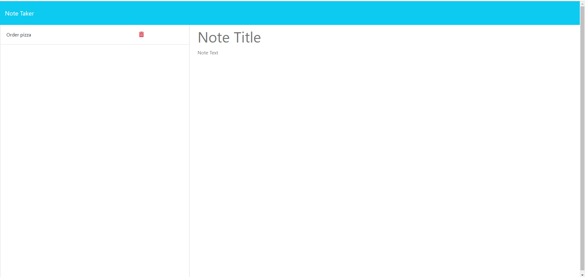

# Note Taker

## Description
This is a note taker for small business owners. It can be used to write and save notes easily. It uses backend storage to save all of your notes so you can leave the page without losing you notes.

## Usage
On the home page, click "Get Started" to bring you to the notes page. You can then enter your note in the right-hand column, and save it using the button at the top. Clicking on a note in the left hand column lets you view it.

## Technologies
- Node.js
- Express

## Screenshots

## Links
https://note-taker-nfk9.onrender.com/
https://github.com/ckisi/note-taker

## Sources
Xpert Learning Assistant
